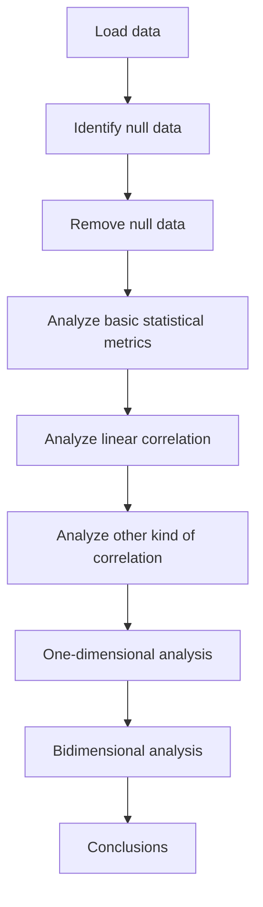

# EDA-liver-cancer-covid

This repository contains the exploratory data analysis of the covid's influence in liver cancer detection.

----

**Table of Contents**

* **EDA_liver_cancer_covid.ipynb** is the jupyter notebook with the data treatment, data analysis, and data visualization.

### Data 

----
- The data comes from the following repository: [https://github.com/sebassaras02/RPT_array_pos.git](https://www.kaggle.com/datasets/fedesoriano/covid19-effect-on-liver-cancer-prediction-dataset)
 
----

### Exploratory Data Analysis results
---
1. Tumors detected in the pre-pandemic time were more smaller than bigger ones.
2. The number of symptomatic tumors increased during the pandemic time.
3. The underlying diseases and known cirrhosis cases were fewer during the pandemic time.
4. The lower tumor, the higher possibility to be alive.

                
### FlowChart of the Model Construction
---

### Contacts:
---
- [Twitter](https://twitter.com/sarasti_seb)
- [LinkedIn](https://linkedin.com/in/sebastiansarasti)
- [ResearchGate](https://www.researchgate.net/profile/Sebastian-Sarasti-2)
